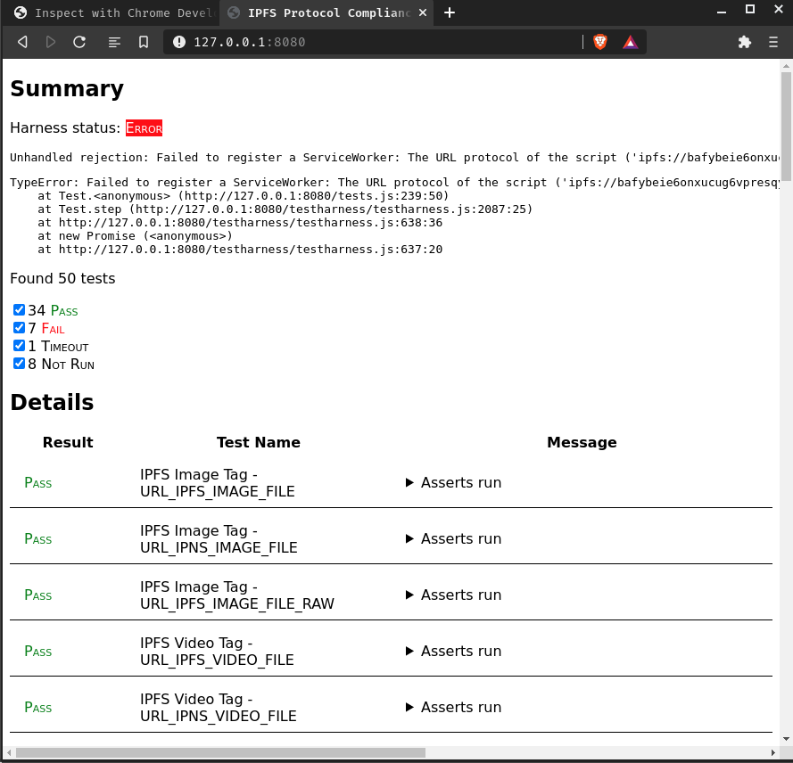
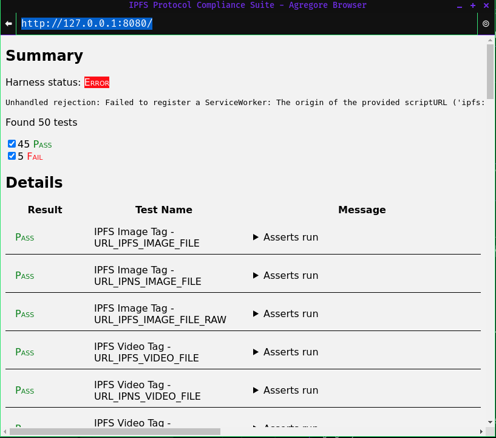

# ipfs-protocol-compliance-suite
A set of HTML pages to test a browser's compliance with `ipfs://` and `ipns://` URLs.

Progress: https://github.com/ipfs/community/discussions/573

## How this works:

- Successor to [ipfs-protocol-handler-support-tests](https://github.com/ipfs/in-web-browsers/blob/master/docs/ipfs-protocol-handler-support-tests.html)
- Tests the browser's ability to handle IPFS URLS
- Using the [Web Platform Tests](https://github.com/web-platform-tests/wpt) repository to define tests
- Testing against a variety of file types and publishing methods (`ipfs://`, `ipns://`)
- Tests:
  - [x] ``
  - [x] `<video src>`
  - [x] `<audio src>`
  - [x] `<style>@import url()`
  - [x] `<link rel="stylesheet">`
  - [ ] `<a href>` navigation (can't simulate clicks, should try [test_dirver](https://github.com/RangerMauve/ipfs-protocol-compliance-suite))
  - [x] `<object data>`
  - [x] `<iframe src>`
  - [x] `<script src>`
  - [x] `<script src type="module">`
  - [x] JS `import from`
  - [x] JS `await import()`
  - [ ] JS `new Worker()` (Getting errors with CORS)
  - [x] JS `navigator.serviceWorker.register`
  - [x] JS `window.location.href` navigation
  - [x] JS `XMLHttpRequest()`
  - [x] JS `fetch()`
  - [x] Generate directory listing for folders
  - [x] Render empty directories
  - [x] Resolve `index.html` in a path
- `mutable.html` Tests (experimental, some things subject to change)
  - [x] JS `fetch('ipfs://<CID>/example.txt', {method: 'PUT'})`
  - [x] JS `fetch('ipfs://<CID>/', {method: 'PUT', body: new FormData})`
  - [x] JS `fetch('ipfs://<CID>/example.txt', {method: 'DELETE'})`
  - [x] JS `fetch('ipns://localhost?key=<name>', {method: 'POST', body: <CID>})`
  - [ ] JS `fetch('ipns://localhost/example.txt?key=<name>', {method: 'POST', body: <CID>})`
  - [ ] JS `fetch('ipns://<key>', {method: 'POST', body: <CID>})`
  - [ ] JS `fetch('ipns://<key>/example.txt', {method: 'POST', body: <CID>})`
  - [ ] JS `fetch('ipns://localhost?key=<name>', {method: 'PUT', body: file or formdata})`
  - [ ] JS `fetch('ipns://localhost/example.txt?key=<name>', {method: 'PUT', body: file or formdata})`
  - [ ] JS `fetch('ipns://<key>', {method: 'PUT', body: file or formdata})`
  - [ ] JS `fetch('ipns://<key>/example.txt', {method: 'PUT', body: file or formdata})`
  - [ ] JS `fetch('ipns://<CID>/example.txt', {method: 'DELETE'})`
- `dag.html` Tests (experimental, some things subject to change)
	- [x] GET `ipfs://<CID>/?format=CAR`
	- [x] GET `ipfs://<CID>/?format=block`
	- [x] GET `ipfs://<CID>/?format=dag-json`
	- [x] GET `ipfs://<CID>/?format=dag-cbor`
	- [x] POST `Content-Type: application/json` `?format=dag-cbor` & GET `?format=dag-cbor`
	- [x] POST over existing CID to add to graph

## Screenshots:

Brave Browser (as of 2021-08-13)

Agregore Browser (as of 2021-08-13)

## Publishing:

This test suite is automatically published on Fleek via CI job.

`HEAD` of the `default` branch is published at https://ipfs-protocol-compliance-suite.on.fleek.co

## Manual publishing:

Manual steps are:

- Set up an IPFS node
- Make sure the `IPNS_ROOT` URL in `publish-files.js` is correct (or override it via environment variable of the same name)
- Run `publish-files.js`
- Pin the IPFS URL somewhere like Pinata
- Update the DNS domain to point to the IPFS URL using DNSLink
- Commit and push the changes (thus updating gh-pages)
